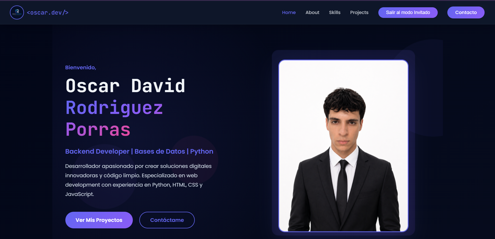
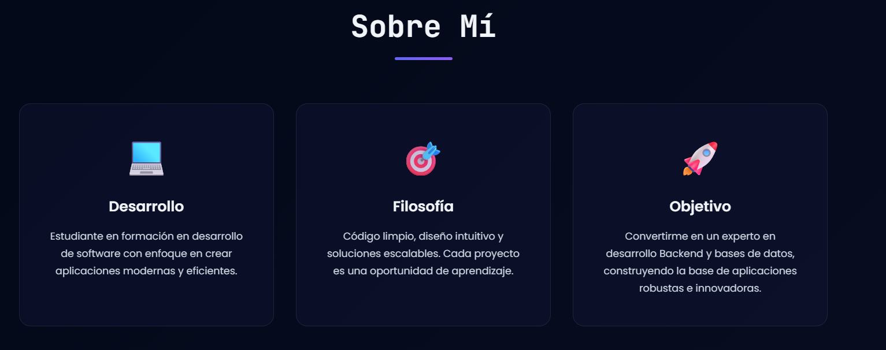
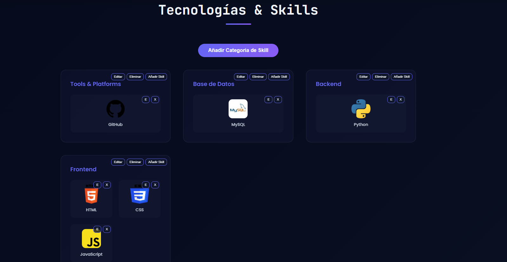
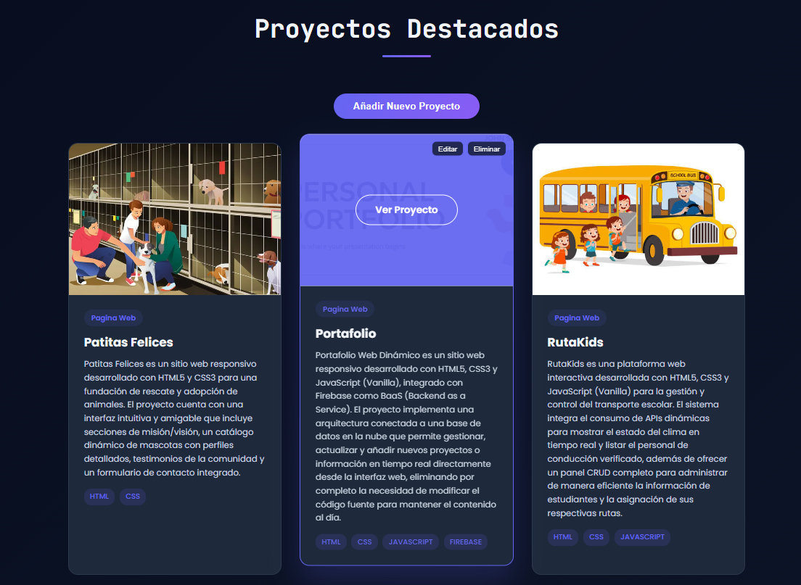

# 💻 Portafolio Web Dinámico

Portafolio profesional desarrollado con **HTML5, CSS3 y JavaScript Vanilla**, diseñado para mostrar información personal, habilidades técnicas, proyectos destacados y medios de contacto de manera moderna, responsiva y completamente administrable.

A diferencia de un portafolio estático tradicional, este proyecto está conectado a **Firebase**, permitiendo gestionar contenido en tiempo real sin necesidad de modificar el código fuente.

---

## 🚀 Características

- 🎨 Diseño moderno y responsivo.
- 🌙 Interfaz con temática oscura.
- 👤 Sección de presentación personal.
- 📖 Apartado "Sobre Mí".
- 🛠️ Gestión dinámica de Skills.
- 📊 Barras de nivel de dominio.
- 📂 Gestión dinámica de proyectos.
- 📱 Compatible con dispositivos móviles.
- ☁️ Integración con Firebase.
- 🔄 Actualización de contenido en tiempo real.

---

## 🛠️ Tecnologías Utilizadas

### Frontend
- HTML5
- CSS3
- JavaScript (Vanilla)

### Backend as a Service
- Firebase Firestore

### Control de Versiones
- Git
- GitHub

---

## ☁️ Integración con Firebase

El proyecto utiliza **Firebase Firestore** como base de datos en la nube.

Gracias a esta integración es posible:

- Añadir nuevas categorías de habilidades.
- Agregar nuevas tecnologías.
- Editar habilidades existentes.
- Eliminar habilidades.
- Añadir nuevos proyectos.
- Editar proyectos existentes.
- Eliminar proyectos.
- Sincronizar cambios en tiempo real.

Todo esto se realiza directamente desde la interfaz web, sin necesidad de editar archivos HTML, CSS o JavaScript manualmente.

---

## 📸 Vista Previa

### Página Principal



### Sobre Mí



### Skills Dinámicas



### Proyectos Destacados



---

## 📂 Estructura del Proyecto

```bash
📦 portafolio
├── index.html
├── styles.css
├── script.js
├── firebase.js
├── perfil.png
├── imagen-perfil.png
├── logan.png
└── README.md
```

---

## ⚙️ Funcionalidades Administrativas

El sistema cuenta con un modo administrador que permite:

### Gestión de Skills

- Crear categorías.
- Agregar tecnologías.
- Editar información.
- Eliminar elementos.

### Gestión de Proyectos

- Crear nuevos proyectos.
- Subir imágenes.
- Agregar descripción.
- Asignar tecnologías utilizadas.
- Actualizar información existente.
- Eliminar proyectos.

Todos los cambios se almacenan automáticamente en Firebase.

---

## 🎯 Objetivo del Proyecto

Este portafolio fue desarrollado con el objetivo de:

- Mostrar mis habilidades como desarrollador.
- Aplicar conocimientos de HTML, CSS y JavaScript.
- Implementar una arquitectura conectada a servicios en la nube.
- Aprender integración de bases de datos NoSQL mediante Firebase.
- Facilitar la actualización del contenido sin modificar el código fuente.

---

## 👨‍💻 Autor

**Oscar David Rodríguez Porras**

- Backend Developer
- Bases de Datos
- Python Developer

GitHub:
https://github.com/OscarDavidRodriguezPorras

---

## 📄 Licencia

Este proyecto es de uso personal y académico.
